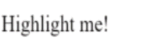

An **attribute** directive changes the appearance or behavior of a DOM element.

Try the .

## Directives overview

There are three kinds of directives in Angular:

1. Components&mdash;directives with a template.
1. Structural directives&mdash;change the DOM layout by adding and removing DOM elements.
1. Attribute directives&mdash;change the appearance or behavior of an element, component, or another directive.

*Components* are the most common of the three directives.
You saw a simple component in the [Starter App]().

*Structural Directives* change the structure of the view.
Two examples are [NgFor](#ngFor) and [NgIf](#ngIf).
Learn about them in the [Structural Directives]() page.

*Attribute directives* are used as attributes of elements.
The built-in [NgStyle](#ngStyle) directive in the
[Template Syntax]() page, for example,
can change several element styles at the same time.

There are two kinds of attribute directive:

- [Class-based](#create-a-directive): A full-featured attribute directive,
  implemented using a class.
- [Functional](#functional): A stateless attribute directive, implemented using
  a top-level function.

## Create a class-based attribute directive

Creating a class-based attribute directive requires writing a controller class
annotated with [@Directive()][], which specifies the selector that identifies
the attribute.
The controller class implements the desired directive behavior.

This page demonstrates building a simple _myHighlight_ attribute
directive to set an element's background color
when the user hovers over that element. You can apply it like this:



### Write the directive code

Follow the [setup](setup) instructions for creating a new local project
named `attribute_directives`.

Create the following source file in the indicated folder:



`@Directive()` requires a CSS selector to identify
the HTML in the template that is associated with the directive.
The [CSS selector for an attribute](https://developer.mozilla.org/en-US/docs/Web/CSS/Attribute_selectors)
is the attribute name in square brackets.
Here, the directive's selector is `[myHighlight]`.
Angular locates all elements in the template that have an attribute named `myHighlight`.


### Why not call it "highlight"?

Though *highlight* is a more concise name than *myHighlight* and would work,
a best practice is to prefix selector names to ensure
they don't conflict with standard HTML attributes.
This also reduces the risk of colliding with third-party directive names.

Make sure you do **not** prefix the `highlight` directive name with **`ng`** because
that prefix is reserved for Angular and using it could cause bugs that are difficult to diagnose.
For a simple demo, the short prefix, `my`, helps distinguish your custom directive.


After the `@Directive()` metadata comes the directive's controller class,
called `HighlightDirective`, which contains the logic for the directive.

Angular creates a new instance of the directive's controller class for
each matching element, injecting an HTML [Element](/stable/dart-html/Element-class.html)
into the constructor.

## Apply the attribute directive

To use the new `HighlightDirective`, create a template that
applies the directive as an attribute to a paragraph (`
`) element.
In Angular terms, the `
` element is the attribute **host**.

Put the template in its own `app_component.html`
file that looks like this:



Now reference this template in the `AppComponent`, and
add the `Highlight` directive to the `directives` list. This way Angular
recognizes the directive when it encounters `myHighlight` in the template.



<!-- TODO: open in browser
<i class="material-icons">open_in_browser</i>
**Refresh the browser.**
The app runs, and the `myHighlight` directive highlights the paragraph text. -->




### Your directive isn't working?

Did you remember to set the `directives` attribute of `@Component`?
It is easy to forget!
Open the console in the browser tools and look for an error like this:

  EXCEPTION: Template parse errors:
  Can't bind to 'myHighlight' since it isn't a known property of 'p'.

Angular detects that you're trying to bind to *something*
but it can't find this directive.
You let Angular know by listing `HighlightDirective` in the `directives` list.


To summarize, Angular found the `myHighlight` attribute on the `
` element.
It created an instance of the `HighlightDirective` class and
injected a reference to the `
` element into the directive's constructor
which sets the `
` element's background style to yellow.

## Respond to user-initiated events

Currently, `myHighlight` simply sets an element color.
The directive could be more dynamic.
It could detect when the user mouses into or out of the element
and respond by setting or clearing the highlight color.

Add two eventhandlers that respond when the mouse enters or leaves,
each adorned by the `HostListener` annotation.



The `@HostListener` annotation lets you subscribe to events of the DOM
element that hosts an attribute directive, the `
` in this case.


  Of course you could reach into the DOM with standard JavaScript and and attach event listeners manually.
  There are at least three problems with _that_ approach:

  1. You have to write the listeners correctly.
  1. The code must *detach* the listener when the directive is destroyed to avoid memory leaks.
  1. Talking to DOM API directly isn't a best practice.


The handlers delegate to a helper method that sets the color on the DOM element, `_el`,
which you declare and initialize in the constructor.



Here's the updated directive in full:



<!-- TODO: open in browser
<i class="material-icons">open_in_browser</i>
**Refresh the browser.** Confirm that the background color appears when
the mouse hovers over the `p` and disappears as it moves out. !-->

<!-- TODO: the figure shortcode doesn't handle GIFs for some reason? -->

## Pass values into the directive with an _@Input_ data binding

Currently the highlight color is hard-coded _within_ the directive. That's inflexible.
In this section, you give the developer the power to set the highlight color while applying the directive.

Start by adding a `highlightColor` property to the directive class like this:



### Binding to an _@Input_ property

Notice the `@Input` annotation. It adds metadata to the class that makes the directive's `highlightColor` property available for binding.

It's called an *input* property because data flows from the binding expression _into_ the directive.
Without that input metadata, Angular rejects the binding; see [below](#why-input "Why add @Input?") for more about that.

Try it by adding the following directive binding variations to the `AppComponent` template:



Add a `color` property to the `AppComponent`.



Let it control the highlight color with a property binding.



That's good, but it would be nice to _simultaneously_ apply the directive and set the color _in the same attribute_ like this.



The `[myHighlight]` attribute binding both applies the highlighting directive to the `
` element
and sets the directive's highlight color with a property binding.
You're re-using the directive's attribute selector (`[myHighlight]`) to do both jobs.
That's a crisp, compact syntax.

You'll have to rename the directive's `highlightColor` property to `myHighlight` because that's now the color property binding name.



This is disagreeable. The word, `myHighlight`, is a terrible property name and it doesn't convey the property's intent.

### Bind to an _@Input_ alias

Fortunately you can name the directive property whatever you want _and_ **_alias it_** for binding purposes.

Restore the original property name and specify the selector as the alias in the argument to `@Input`.



_Inside_ the directive the property is known as `highlightColor`.
_Outside_ the directive, where you bind to it, it's known as `myHighlight`.

You get the best of both worlds: the property name you want and the binding syntax you want:



Now that you're binding to `highlightColor`, modify the `onMouseEnter()` method to use it.
If someone neglects to bind to `highlightColor`, highlight in red:



Here's the latest version of the directive class.



## Write a harness to try it

It may be difficult to imagine how this directive actually works.
In this section, you'll turn `AppComponent` into a harness that
lets you pick the highlight color with a radio button and bind your color choice to the directive.

Update `app_component.html` as follows:



Revise the `AppComponent.color` so that it has no initial value.



<!-- TODO: open in browser
<i class="material-icons">open_in_browser</i>
**Refresh the browser.**
Here are the harness and directive in action. !-->

## Bind to a second property

This highlight directive has a single customizable property. In a real app, it may need more.

At the moment, the default color&mdash;the color that prevails until
the user picks a highlight color&mdash;is hard-coded as "red".
Let the template developer set the default color.

Add a second **input** property to `HighlightDirective` called `defaultColor`:



Revise the directive's `onMouseEnter` so that it first tries to highlight with the `highlightColor`,
then with the `defaultColor`, and falls back to "red" if both properties are undefined.



How do you bind to a second property when you're already binding to the `myHighlight` attribute name?

As with components, you can add as many directive property bindings as you need by stringing them along in the template.
The developer should be able to write the following template HTML to both bind to the `AppComponent.color`
and fall back to "violet" as the default color.



Angular knows that the `defaultColor` binding belongs to the `HighlightDirective`
because you made it _public_ with the `@Input` annotation.

<!-- TODO: open in browser
<i class="material-icons">open_in_browser</i>
**Refresh the browser.**
Here's how the harness should work when you're done coding. !-->

## Write a functional directive

A functional directive is a stateless directive that is rendered once.
You create a functional directive by annotating a public, top-level function with [@Directive()][].

Create the following functional attribute directive:



Like constructor parameters in class-based directives,
function parameters define the functional directive's dependencies.

When you write a functional directive, follow these rules:

- Make the function return type `void`.
- In the [@Directive()][] annotation,
  use only the `selector` parameter and, if necessary, `providers`.

While functional directives are stateless, they can be impure
(making use of global state), as the `autoId` directive shows.

Add the following lines at the end of the app component template:


<!-- TODO: open in browser
<i class="material-icons">open_in_browser</i>
**Refresh the browser.** The app reports headings ID `heading-0` and `heading-1`. !-->

## Summary

This page covered how to:

- [Create a **class-based attribute directive**](#create-a-directive) that
  modifies the behavior of an element.
- [Apply an attribute directive](#apply-directive) to an element in a template.
- [Respond to **events**](#respond-to-user) that change a class-based directive's behavior.
- [**Bind** values](#bindings) to a class-based directive.
- [Write a **functional** attribute directive](#functional).

The final source code follows:


<!-- <code-tabs>
  <?code-pane "lib/app_component.dart" linenums?>
  <?code-pane "lib/app_component.html" linenums?>
  <?code-pane "lib/src/auto_id_directive.dart" linenums?>
  <?code-pane "lib/src/highlight_directive.dart" linenums?>
  <?code-pane "web/main.dart" linenums?>
  <?code-pane "web/index.html" linenums?>
</code-tabs> !-->

You can also experience and download the .

### Appendix: Why add _@Input_?

In this demo, the `hightlightColor` property is an ***input*** property of
the `HighlightDirective`. You've seen it applied without an alias:



You've seen it with an alias:



Either way, the `@Input` annotation tells Angular that this property is
_public_ and available for binding by a parent component.
Without  `@Input`, Angular refuses to bind to the property.

You've bound template HTML to component properties before and never used `@Input`.
What's different?

The difference is a matter of trust.
Angular treats a component's template as _belonging_ to the component.
The component and its template trust each other implicitly.
Therefore, the component's own template may bind to _any_ property of that component,
with or without the `@Input` annotation.

But a component or directive shouldn't blindly trust _other_ components and directives.
The properties of a component or directive are hidden from binding by default.
They are _private_ from an Angular binding perspective.
When adorned with the `@Input` annotation, the property becomes _public_ from an Angular binding perspective.
Only then can it be bound by some other component or directive.

You can tell if `@Input` is needed by the position of the property name in a binding.

* When it appears in the template expression to the ***right*** of the equals (=),
  it belongs to the template's component and does not require the `@Input` annotation.

* When it appears in **square brackets** (\[ \]) to the **left** of the equals (=),
  the property belongs to some _other_ component or directive;
  that property must be adorned with the `@Input` annotation.

Now apply that reasoning to the following example:



* The `color` property in the expression on the right belongs to the template's component.
  The template and its component trust each other.
  The `color` property doesn't require the `@Input` annotation.

* The `myHighlight` property on the left refers to an _aliased_ property of the `HighlightDirective`,
  not a property of the template's component. There are trust issues.
  Therefore, the directive property must carry the `@Input` annotation.

[@Directive()]: /ngdart/latest/di/Directive-class.html
