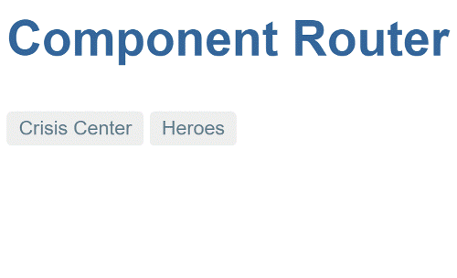

<!--  !-->

For this first milestone, you'll create a rudimentary
version of the app that navigates between two (placeholder) views.



## App setup

Create a **new project** named `router_example`, and populate it as described in
[Setup for Development]().

### Add angular_router

Add the router and forms packages as pubspec dependencies:


Versions may be out-of-date. Please use the latest versions according to Pub or
GitHub.




### Add router providers

To tell Angular that your app uses the router,
specify [routerProvidersHash][] in your app's bootstrap function:



<!--



//- TODO: update the discussion of base-href; see toh. E.g., cover meaningful values when used via WebStorm or when deployed
//- The auto toc generator can't handle  bas href

!-->

<a id="base-href"></a>

### Set the *base href*

Add a [\<base href> element][base] to the app's `index.html`.
The browser uses the `base` `href` value to prefix *relative* URLs when referencing CSS files, scripts, and images.
The router uses the `base` `href` value to prefix *relative* URLs when navigating.

The [starter app]() sets the `<base>` element dynamically,
so that sample apps built from it can be **run and tested during development** using any
of the [**officially recommended tools**](#running-the-app):



For a **production** build, **replace the `<script>`** with a
`<base>` element where the `href` is set to your app's **root path**.
If the path is empty, then use `"/"`:

```html
<head>
  <base href="/">
  ...
</head>
```

You can also statically set the `<base href>` during development.
When serving from the command line, use `href="/"`.
When running apps from WebStorm, use <code>href="<em>my_project</em>/web/"</code>,
where <em>my_project</em> is the name of your project.

```html
<base href="/my_project/web/">
```

<!--

TODO: also mention appBaseHref?

!-->

### Create crisis and hero list components

Create the following skeletal components under `lib/src`. You'll be using these as router
navigation targets in the next section:



## Routes

*Routes* tell the router which views to display when a user clicks a link or
pastes a URL into the browser address bar.

### Route paths

First define a _route path_ ([RoutePath][]) for each
of the app's views:




  **Guideline:** By defining route paths in a separate file, you can avoid
  circular dependencies between route definitions in apps with a rich
  navigational structure.
  <!--  See
  https://github.com/dart-lang/angular/edit/master/angular_router/g3doc/migration_guide.md
   !-->


### Route definitions

The router coordinates app navigation based on a list of route defintions.
A route definition ([RouteDefinition][]) associates a route path with a
component. The component is responsible for handling navigation to the path,
and rendering of the associated view.

Define the following routes:



## *AppComponent* navigation

Next, you'll edit `AppComponent` so that it has
a title,
a navigation bar with two links, and
a *router outlet* where the router swaps views on and off the page.
This is what it will look like:



Update the `AppComponent` code to the following:



<a id="router-directives"></a>
### *RouterOutlet*

[RouterOutlet][] is one of the **[routerDirectives.][routerDirectives]**
To use a router directive like `RouterOutlet` within a
component, add it individually to the component's `directives` list,
or for convenience you can add the [routerDirectives][] list:

<!-- TODO: use new docregion instead of the ugly regex

!-->
```dart
  template: '''
    ...
    <router-outlet [routes]="Routes.all"></router-outlet>
  ''',
  directives: [routerDirectives],
```

In the DOM, the router diplays views (for the routes bound to the `routes`
[input property][property binding]) by inserting view elements as siblings
immediately _after_ `<router-outlet>`.

### *RouterLink*s {#router-link}

Above the outlet, within anchor tags, you see
[property bindings][property binding] to [RouterLink][] directives.
Each router link is bound to a route path.



Set the [RouterLink][] `routerLinkActive` property to the CSS class
that the router will apply to the element when its route is active.

<!-- TODO: same as above, use more granular docregion
 !-->
```dart
  template: '''...
      <a [routerLink]="RoutePaths.crises.toUrl()"
         [routerLinkActive]="'active-route'">Crisis Center</a>
      <a [routerLink]="RoutePaths.heroes.toUrl()"
         [routerLinkActive]="'active-route'">Heroes</a>
  ...''',
  styles: ['.active-route {color: #039be5}'],
```

<a id="wrap-up"></a>
## App code

You've got a very basic, navigating app, one that can switch between two views
when the user clicks a link. The app's structure looks like this:

<div class="ul-filetree">

- router_example
  - lib
    - app_component.dart
    - src
      - crisis_list_component.dart
      - hero_list_component.dart
      - route_paths.dart
      - routes.dart
  - web
    - index.html
    - main.dart
    - styles.css

</div>

Here are the files discussed in this milestone



[base]: https://developer.mozilla.org/en-US/docs/Web/HTML/Element/base
[property binding]: #property-binding
[routerDirectives]: /ngrouter/latest/angular_router/routerDirectives-constant.html
[routerProviders]: /ngrouter/latest/angular_router/routerProviders-constant.html
[routerProvidersHash]: /ngrouter/latest/angular_router/routerProvidersHash-constant.html
[RouteDefinition]: /ngrouter/latest/angular_router/RouteDefinition-class.html
[RouterLink]: /ngrouter/latest/angular_router/RouterLink-class.html
[RouterOutlet]: /ngrouter/latest/angular_router/RouterOutlet-class.html
[RoutePath]: /ngrouter/latest/angular_router/RoutePath-class.html
