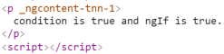
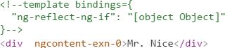
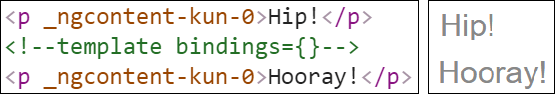
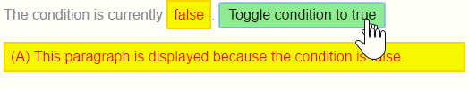

<!--
TODO(GZGavinZhao): is this still true?
%comment
We're currently using <template> until <ng-container> becomes available;
hence the page variable named `ng_container` set to `template` in the front matter.
Btw, <template> is soon to be renamed <ng-template> in ngTS.
%comment
!-->

This guide looks at how Angular manipulates the DOM with **structural directives** and
how you can write your own structural directives to do the same thing.

Try the .

<div id="definition"></div>

## What are structural directives?

Structural directives are responsible for HTML layout.
They shape or reshape the DOM's _structure_, typically by adding, removing, or manipulating
elements.

As with other directives, you apply a structural directive to a _host element_.
The directive then does whatever it's supposed to do with that host element and its descendents.

Structural directives are easy to recognize.
An asterisk (*) precedes the directive attribute name as in this example.



No brackets. No parentheses. Just `*ngIf` set to a string.

You'll learn in this guide that the [asterisk (*) is a convenience notation](#asterisk)
and the string is a [_microsyntax_](#microsyntax) rather than the usual
[template expression](#template-expressions).
Angular desugars this notation into a marked-up `<template>` that surrounds the
host element and its descendents.
Each structural directive does something different with that template.

Three of the common, built-in structural directives &mdash; [NgIf](#ngIf),
[NgFor](#ngFor), and [NgSwitch...](#ngSwitch) &mdash; are
described in the [_Template Syntax_](template-syntax) guide and seen in samples throughout the Angular documentation.
Here's an example of them in a template:



This guide won't repeat how to _use_ them. But it does explain _how they work_
and how to [write your own](#unless) structural directive.


#### Directive spelling

Throughout this guide, you'll see a directive spelled in both _UpperCamelCase_ and _lowerCamelCase_.
Already you've seen `NgIf` and `ngIf`.
There's a reason. `NgIf` refers to the directive _class_;
`ngIf` refers to the directive's _attribute name_.

A directive _class_ is spelled in _UpperCamelCase_ (`NgIf`).
A directive's _attribute name_ is spelled in _lowerCamelCase_ (`ngIf`).
The guide refers to the directive _class_ when talking about its properties and what the directive does.
The guide refers to the _attribute name_ when describing how
you apply the directive to an element in the HTML template.



There are two other kinds of Angular directives, described extensively elsewhere:
(1) components and (2) attribute directives.

A *component* manages a region of HTML in the manner of a native HTML element.
Technically it's a directive with a template.

An [*attribute* directive]() changes the appearance or behavior
of an element, component, or another directive.
For example, the built-in [`NgStyle`](#ngStyle) directive
changes several element styles at the same time.

You can apply many _attribute_ directives to one host element.
You can [only apply one](#one-per-element) _structural_ directive to a host element.


## NgIf case study {#ngIf}

`NgIf` is the simplest structural directive and the easiest to understand.
It takes a boolean expression and makes an entire chunk of the DOM appear or disappear.



The `ngIf` directive doesn't hide elements with CSS. It adds and removes them physically from the DOM.
Confirm that fact using browser developer tools to inspect the DOM.

<!-- TODO: why is this blurry?

!-->


The top paragraph is in the DOM. The bottom, disused paragraph is not;
in its place is a comment about "template bindings" (more about that [later](#asterisk)).

When the condition is false, `NgIf` removes its host element from the DOM,
detaches it from DOM events (the attachments that it made),
detaches the component from Angular change detection, and destroys it.
The component and DOM nodes can be garbage-collected and free up memory.

### Why *remove* rather than *hide*?

A directive could hide the unwanted paragraph instead by setting its `display` style to `none`.



While invisible, the element remains in the DOM.

<!-- TODO: use image shortcode once the blurry problem goes away...
 !-->


The difference between hiding and removing doesn't matter for a simple paragraph.
It does matter when the host element is attached to a resource intensive component.
Such a component's behavior continues even when hidden.
The component stays attached to its DOM element. It keeps listening to events.
Angular keeps checking for changes that could affect data bindings.
Whatever the component was doing, it keeps doing.

Although invisible, the component&mdash;and all of its descendant components&mdash;tie up resources.
The performance and memory burden can be substantial, responsiveness can degrade, and the user sees nothing.

On the positive side, showing the element again is quick.
The component's previous state is preserved and ready to display.
The component doesn't re-initialize&mdash;an operation that could be expensive.
So hiding and showing is sometimes the right thing to do.

But in the absence of a compelling reason to keep them around,
your preference should be to remove DOM elements that the user can't see
and recover the unused resources with a structural directive like `NgIf` .

**These same considerations apply to every structural directive, whether built-in or custom.**
Before applying a structural directive, you might want to pause for a moment
to consider the consequences of adding and removing elements and of creating and destroying components.

## The asterisk (*) prefix {#asterisk}

Surely you noticed the asterisk (*) prefix to the directive name
and wondered why it is necessary and what it does.

Here is `*ngIf` displaying the hero's name if `hero` exists.



The asterisk is [syntactic sugar][] for something a bit more complicated.
Internally, Angular desugars it into a [template element][], wrapped around the host element, like this.



* The `*ngIf` directive moved to the `<template>` element where it became a property binding,`[ngIf]`.
* The rest of the `<div>`, including its class attribute, moved inside the `<template>` element.

None of these forms are actually rendered.
Only the finished product ends up in the DOM.

<!-- TODO: use figure shortcode !-->


Angular consumed the `<template>` content during its actual rendering and
replaced the `<template>` with a diagnostic comment.

The [NgFor](#ngFor) and [NgSwitch](#ngSwitch) directives follow the same pattern.

## Inside _*ngFor_ {#ngFor}

Angular transforms the `*ngFor` in similar fashion from asterisk (*) syntax through
template _attribute_ to template _element_.

Here's a full-featured app of `NgFor`, written all three ways:



This is manifestly more complicated than `ngIf` and rightly so.
The `NgFor` directive has more features, both required and optional, than the `NgIf` shown in this guide.
At minimum `NgFor` needs a looping variable (`let hero`) and a list (`heroes`).

You enable these features in the string assigned to `ngFor`, which you write in Angular's [microsyntax](#microsyntax).


Everything _outside_ the `ngFor` string stays with the host element
(the `<div>`) as it moves inside the `<template>`.
In this example, the `[ngClass]="odd"` stays on the `<div>`.


### Microsyntax

The Angular microsyntax lets you configure a directive in a compact, friendly string.
The microsyntax parser translates that string into attributes on the `<template>`:

* The `let` keyword declares a [_template input variable_](#template-input-variable)
that you reference within the template. The input variables in this example are `hero`, `i`, and `odd`.
The parser translates `let hero`, `let i`, and `let odd` into variables named,
`let-hero`, `let-i`, and `let-odd`.

* The microsyntax parser takes `of` and `trackby`, title-cases them (`of` -> `Of`, `trackBy` -> `TrackBy`),
and prefixes them with the directive's attribute name (`ngFor`), yielding the names `ngForOf` and `ngForTrackBy`.
Those are the names of two `NgFor` _input properties_ .
That's how the directive learns that the list is `heroes` and the track-by function is `trackById`.

* As the `NgFor` directive loops through the list, it sets and resets properties of its own _context_ object.
These properties include `index` and `odd` and a special property named `$implicit`.

* The `let-i` and `let-odd` variables were defined as `let i=index` and `let odd=odd`.
Angular sets them to the current value of the context's `index` and `odd` properties.

* The context property for `let-hero` wasn't specified.
It's intended source is implicit.
Angular sets `let-hero` to the value of the context's `$implicit` property
which `NgFor` has initialized with the hero for the current iteration.

* The [API guide](/ngdart/latest/angular/NgFor-class.html "API: NgFor")
describes additional `NgFor` directive properties and context properties.

These microsyntax mechanisms are available to you when you write your own structural directives.
Studying the source code for `NgIf` and `NgFor` is a great way to learn more.

<div id="template-input-variables"></div>

### Template input variable

A _template input variable_ is a variable whose value you can reference _within_ a single instance of the template.
There are several such variables in this example: `hero`, `i`, and `odd`.
All are preceded by the keyword `let`.

A _template input variable_ is **_not_** the same as a
[template _reference_ variable](#ref-vars),
neither _semantically_ nor _syntactically_.

You declare a template _input_ variable using the `let` keyword (`let hero`).
The variable's scope is limited to a _single instance_ of the repeated template.
You can use the same variable name again in the definition of other structural directives.

You declare a template _reference_ variable by prefixing the variable name with `#` (`#var`).
A _reference_ variable refers to its attached element, component or directive.
It can be accessed _anywhere_ in the _entire template_.

Template _input_ and _reference_ variable names have their own namespaces. The `hero` in `let hero` is never the same
variable as the `hero` declared as `#hero`.

<div id="one-per-element"></div>

### One structural directive per host element

Someday you'll want to repeat a block of HTML but only when a particular condition is true.
You'll _try_ to put both an `*ngFor` and an `*ngIf` on the same host element.
Angular won't let you. You may apply only one _structural_ directive to an element.

The reason is simplicity. Structural directives can do complex things with the host element and its descendents.
When two directives lay claim to the same host element, which one takes precedence?
Which should go first, the `NgIf` or the `NgFor`? Can the `NgIf` cancel the effect of the `NgFor`?
If so (and it seems like it should be so), how should Angular generalize the ability to cancel for other structural directives?

There are no easy answers to these questions. Prohibiting multiple structural directives makes them moot.
There's an easy solution for this use case: put the `*ngIf` on a container element that wraps the `*ngFor` element.
One or both elements can be an [``](#ngcontainer) so you don't have to introduce extra levels of HTML.

## Inside _NgSwitch_ directives {#ngSwitch}

The Angular _NgSwitch_ is actually a set of cooperating directives: `NgSwitch`, `NgSwitchCase`, and `NgSwitchDefault`.

Here's an example.




  You might come across an `NgSwitchWhen` directive in older code.
  That is the deprecated name for `NgSwitchCase`.


The switch value assigned to `NgSwitch` (`hero.emotion`) determines which
(if any) of the switch cases are displayed.

`NgSwitch` itself is not a structural directive.
It's an _attribute_ directive that controls the behavior of the other two switch directives.
That's why you write `[ngSwitch]`, never `*ngSwitch`.

`NgSwitchCase` and `NgSwitchDefault` _are_ structural directives.
You attach them to elements using the asterisk (*) prefix notation.
An `NgSwitchCase` displays its host element when its value matches the switch value.
The `NgSwitchDefault` displays its host element when no sibling `NgSwitchCase` matches the switch value.


  The element to which you apply a directive is its _host_ element.
  The `<happy-hero>` is the host element for the happy `*ngSwitchCase`.
  The `<unknown-hero>` is the host element for the `*ngSwitchDefault`.


As with other structural directives, the `NgSwitchCase` and `NgSwitchDefault`
can be desugared into the `<template>` element form.



## Prefer the asterisk (*) syntax  {#prefer-asterisk}

The asterisk (*) syntax is more clear than the other desugared forms.
<!-- Use [&lt;ng-container&gt;](#ng-container) when there's no single element to host the directive. !-->

While there's rarely a good reason to apply a structural directive in template _attribute_ or _element_ form,
it's still important to know that Angular creates a `<template>` and to understand how it works.
You'll refer to the `<template>` when you [write your own structural directive](#unless).

## The *template* element  {#template}

The HTML 5 [template element][] is a formula for rendering HTML.
It is never displayed directly.
In fact, before rendering the view, Angular _replaces_ the `<template>` and its contents with a comment.

If there is no structural directive and you merely wrap some elements in a `<template>`,
those elements disappear.
That's the fate of the middle "Hip!" in the phrase "Hip! Hip! Hooray!".



Angular erases the middle "Hip!", leaving the cheer a bit less enthusiastic.

<!-- TODO: use figure shortcode !-->


A structural directive puts a `<template>` to work
as you'll see when you [write your own structural directive](#unless).

<div id="group-elements"></div>
<div id="ngcontainer"></div>
<div id="ng-container"></div>

## Group sibling elements

There's often a _root_ element that can and should host the structural directive.
The list element (`<li>`) is a typical host element of an `NgFor` repeater.



When there isn't a host element, you can usually wrap the content in a native HTML container element,
such as a `<div>`, and attach the directive to that wrapper.



Introducing another container element&mdash;typically a `<span>` or `<div>`&mdash;to
group the elements under a single _root_ is usually harmless.
_Usually_ ... but not _always_.

The grouping element may break the template appearance because CSS styles
neither expect nor accommodate the new layout.
For example, suppose you have the following paragraph layout.



You also have a CSS style rule that happens to apply to a `<span>` within a `<p>`aragraph.



The constructed paragraph renders strangely.

<!-- TODO: use figure shortcode !-->


The `p span` style, intended for use elsewhere, was inadvertently applied here.

Another problem: some HTML elements require all immediate children to be of a specific type.
For example, the `<select>` element requires `<option>` children.
You can't wrap the _options_ in a conditional `<div>` or a `<span>`.

When you try this,



the drop down is empty.

<!-- TODO: use figure shortcode !-->


The browser won't display an `<option>` within a `<span>`.

<!-- TODO: if I use this, this becomes "HAHAHUGOSHORTCODEs30HBHB to the rescue!" !-->
<!-- ### ** to the rescue !-->
### *template* to the rescue

The Angular `<>` is a grouping element that doesn't interfere with styles or layout
because Angular _doesn't put it in the DOM_.

Here's the conditional paragraph again, this time using `<>`.



It renders properly. Notice the use of a desugared form of [NgIf](#ngIf).


Now conditionally exclude a _select_ `<option>` with `<>`.



The drop down works properly.


The `<>` is a syntax element recognized by the Angular parser.
It's not a directive, component, class, or interface.
It's more like the curly braces in a Dart `if`-block:

```dart
if (someCondition) {
  statement1;
  statement2;
  statement3;
}
```

Without those braces, Dart would only execute the first statement
when you intend to conditionally execute all of them as a single block.
The `<>` satisfies a similar need in Angular templates.

## Write a structural directive {#unless}

In this section, you write an `UnlessDirective` structural directive
that does the opposite of `NgIf`.
`NgIf` displays the template content when the condition is `true`.
`UnlessDirective` displays the content when the condition is ***false***.



Creating a directive is similar to creating a component.
Here's how you might begin:



The directive's _selector_ is typically the directive's **attribute name** in square brackets, `[myUnless]`.
The brackets define a CSS
<a href="https://developer.mozilla.org/en-US/docs/Web/CSS/Attribute_selectors" target="_blank" rel="noopener" title="MDN: Attribute selectors">attribute selector</a>.

The directive _attribute name_ should be spelled in _lowerCamelCase_ and begin with a prefix.
Don't use `ng`. That prefix belongs to Angular.
Pick something short that fits you or your company.
In this example, the prefix is `my`.

The directive _class_ name ends in `Directive`.
Angular's own directives do not.

### _TemplateRef_ and _ViewContainerRef_

A simple structural directive like this one creates an
[_embedded view_](/ngdart/latest/angular/EmbeddedViewRef-class.html "API: EmbeddedViewRef")
from the Angular-generated `<template>` and inserts that view in a
[_view container_](/ngdart/latest/angular/ViewContainerRef-class.html "API: ViewContainerRef")
adjacent to the directive's original `<p>` host element.

You'll acquire the `<template>` contents with a
[`TemplateRef`](/ngdart/latest/angular/TemplateRef-class.html "API: TemplateRef")
and access the _view container_ through a
[`ViewContainerRef`](/ngdart/latest/angular/ViewContainerRef-class.html "API: ViewContainerRef").

You inject both in the directive constructor as private variables of the class.



### The _myUnless_ property

The directive consumer expects to bind a true/false condition to `[myUnless]`.
That means the directive needs a `myUnless` property, decorated with `@Input`


  Read about `@Input` in the [_Template Syntax_](#inputs-outputs) guide.




Angular sets the  `myUnless` property whenever the value of the condition changes.
Because the `myUnless` property does work, it needs a setter.

* If the condition is false and the view hasn't been created previously,
tell the _view container_ to create the _embedded view_ from the template.

* If the condition is true and the view is currently displayed,
clear the container which also destroys the view.

Nobody reads the `myUnless` property so it doesn't need a getter.

The completed directive code looks like this:



Add this directive to the `directives` list of the AppComponent.

Then create some HTML to try it.



When the `condition` is false, the top (A) paragraph appears and the bottom (B) paragraph disappears.
When the `condition` is true, the top (A) paragraph is removed and the bottom (B) paragraph appears.



## Summary

You can both try and download the source code for this guide in the .

Here is the source under the `lib` folder.



You learned

* that structural directives manipulate HTML layout.
* to use [`<>`](#ngcontainer) as a grouping element when there is no suitable host element.
* that the Angular desugars [asterisk (*) syntax](#asterisk) into a `<template>`.
* how that works for the `NgIf`, `NgFor` and `NgSwitch` built-in directives.
* about the [_microsyntax_](#microsyntax) that expands into a [`<template>`](#template).
* to write a [custom structural directive](#unless), `UnlessDirective`.

[syntactic sugar]: https://en.wikipedia.org/wiki/Syntactic_sugar
[template element]: https://developer.mozilla.org/en-US/docs/Web/HTML/Element/template
