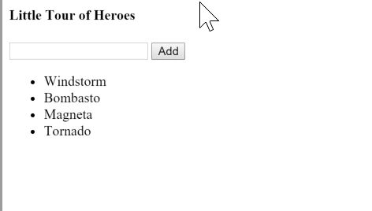

User actions such as clicking a link, pushing a button, and entering text raise
DOM events. This page explains how to bind those events to component event
handlers using the Angular event binding syntax.

Run the .

## Binding to user input events

You can use [Angular event bindings](#event-binding) to respond
to any [DOM event][]. Many DOM events are triggered by user input. Binding to
these events provides a way to get input from the user.

To bind to a DOM event, surround the DOM event name in parentheses and assign a
quoted [template statement](#template-statements) to it.
The following example at line 2 shows an event binding that implements a click
handler:



<a id="click"></a>
The `(click)` to the left of the equal sign identifies the button's click event
as the **target of the binding**. The text in quotes to the right of the equals
sign is the **template statement**, which responds to the click event by calling
the component's `onClickMe()` method.

When writing a binding, be aware of a template statement's **execution
context**. The identifiers in a template statement belong to a specific context
object, usually the Angular component controlling the template. The example
above shows a single line of HTML, but that HTML belongs to a larger component:



When the user clicks the button, Angular calls the `onClickMe()` method from
`ClickMeComponent`.

## Get user input from the $event object

DOM events carry a payload of information that may be useful to the component.
This section shows how to bind to the `keyup` events of an input box to get the
user's input after each keystroke.

The following code listens for a `keyup` event, and passes the entire event
payload (`$event`) to the component event handler.


<?code-excerpt "lib/src/keyup_components.dart (v1 template)" title?>


**Note:**
Non-[raw strings](/guides/language/language-tour#strings)
in Dart files need a `\` in front of the `$`. If the template is in an HTML
file, use `$event` instead of `\$event`.


When a user presses and releases a key, a `keyup` event occurs, and Angular
provides a corresponding DOM event object in the `$event` variable, which this
code passes as a parameter to the component's `onKey()` method.



The properties of an `$event` object vary depending on the type of DOM
event. For example, a mouse event includes different information than a input
box editing event.

All standard DOM [Event][] objects have a `target` property, which is a
reference to the element that raised the event. In this case, `target` refers to
the [`<input>` element][HTMLInputElement], and `event.target.value` returns the
current contents of that element.

After each call, the `onKey()` method appends the input box value to the
component's `values` property, followed by a separator character (`|`). The
template uses Angular [interpolation](#interpolation)
(`{!{...}!}`) to display the `values` property.

Suppose the user enters the letters "abc", and then backspaces to remove them
one by one. Here's what the UI displays:

```nocode
  a | ab | abc | ab | a | |
```

<!-- TODO:  destroys gif-ability:  -->
<!--  -->

<br/>
<br/>

Alternatively, you can accumulate the individual keys themselves by
substituting `event.key` for `event.target.value`. In that case, the same user
input produces the following:

```nocode
  a | b | c | Backspace | Backspace | Backspace |
```

<a id="keyup1"></a>
### Type _event_

The example above declares the `onKey()` `event` parameter to be `dynamic`.
Although that simplifies the code a bit, using a more specific type can
reveal properties of the event object and prevent silly mistakes.

The following example rewrites the method with types:



Now `event` is declared as a `KeyboardEvent`, and `event.target` as an
`InputElement` &mdash; one of the element types that has a `value` property.
With these types, the `onKey()` method more clearly expresses what it expects
from the template and how it interprets the event.

### Passing _$event_ is a dubious practice

Typing the event object reveals a significant issue with passing the entire
DOM event into the method: the component is closely tied to the template
details. The component can't extract data without using web APIs. That breaks
the separation of concerns between the template (_what the user sees_) and the
component (_how the application processes user data_).

The next section shows how to use template reference variables to address this
problem.

## Get user input from a template reference variable

There's another way to get the user data: Angular [**template reference
variables**](#ref-vars) provide direct access to an element from
within the template. To declare a template reference variable, precede an
identifier with a hash character (`#`).

The following example uses a template reference variable to implement a
keystroke loopback in a simple template.



The template reference variable named `box`, declared on the `<input>`
element, refers to the `<input>` element itself. The code uses the `box`
variable to get the input element's `value` and display it with interpolation
between `<p>` tags.

The template is completely self contained. It doesn't bind to the component,
and the component does nothing.

Type something in the input box, and watch the display update with each
keystroke.

<!-- TODO: same as above, broken gif in figure shortcode -->



**This won't work at all unless you bind to an event**.

Angular updates the bindings (and therefore the screen) only if the app does
something in response to asynchronous events, such as keystrokes. This
example binds `keyup` events to the number 0, the shortest template
statement possible. While the statement does nothing useful, it satisfies
Angular's requirement so that Angular will update the screen.


It's easier to get to the input box with the template reference variable than
to go through the `$event` object. Here's a rewrite of the previous `keyup`
example that uses a template reference variable to get the user's input.



A nice aspect of this approach is that the component gets clean data values
from the view. It no longer requires knowledge of the `$event` and its
structure.

<a id="key-event"></a>
## Key event filtering (with `key.enter`)

The `(keyup)` event handler hears *every keystroke*. Sometimes only the
_Enter_ key matters, because it signals that the user has finished typing.
One way to reduce the noise would be to examine every `$event.keyCode` and
take action only when the key is _Enter_.

There's an easier way: bind to Angular's `keyup.enter` pseudo-event. Then
Angular calls the event handler only when the user presses _Enter_.



Here's how it works.

<!-- TODO: same as above, broken gif -->


## On blur

In the previous example, the current state of the input box is lost if the
user clicks elsewhere on the page without first pressing _Enter_. The
component's `value` property is updated only when the user presses _Enter_.

To fix this issue, listen to both the _Enter_ key and the _blur_ event.



## Put it all together

The previous page showed how to [display data](displaying-data). This page
demonstrated event binding techniques.

Now, put it all together in a micro-app that can display a list of heroes and
add new heroes to the list. The user can add a hero by typing the hero's name
in the input box and clicking **Add**.

<!-- Same as above, broken gif -->

<br/>
<br/>

Below is the "Little Tour of Heroes"  component.



### Observations

- **Use template variables to refer to elements**. The `newHero`
  template variable refers to the `<input>` element. You can reference
  `newHero` from any sibling or child of the `<input>` element.

- **Pass values, not elements**. Instead of passing the `newHero` into
  the component's `addHero()` method, get the input box value and pass *that* to
  `addHero()`.

- **Keep template statements simple**. The `(blur)` event is bound to
  two statements. The first statement calls `addHero()`. The second
  statement, `newHero.value=''`, clears the input box after a new hero is
  added to the list.

## Source code

Here is all the code discussed in this page.



## Summary

You've seen the basic primitives for responding to user input and gestures.

These techniques are useful for small-scale demos, but they quickly become
verbose and clumsy when handling large amounts of user input. Two-way data
binding is a more elegant and compact way to move values between data entry
fields and model properties. The next page, `Forms`, explains how to write
two-way bindings with `NgModel`.

[DOM event]: https://developer.mozilla.org/en-US/docs/Web/Events
[Event]: https://developer.mozilla.org/en-US/docs/Web/API/Event
[HTMLInputElement]: https://developer.mozilla.org/en-US/docs/Web/API/HTMLInputElement
